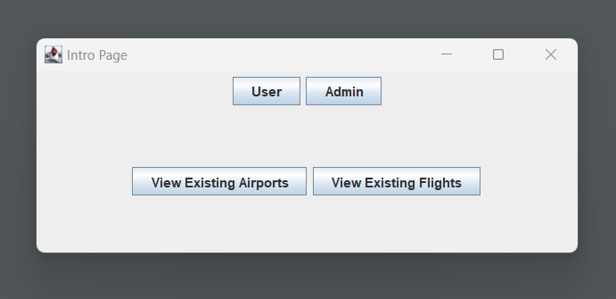
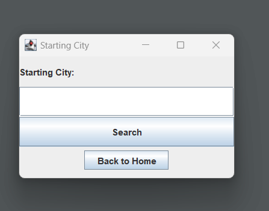
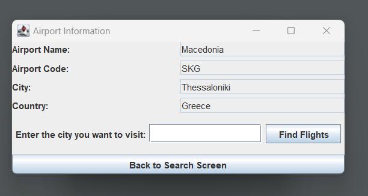
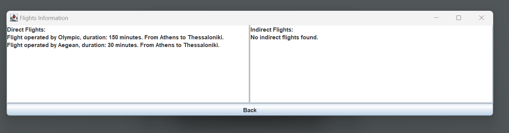
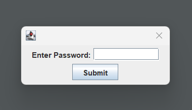
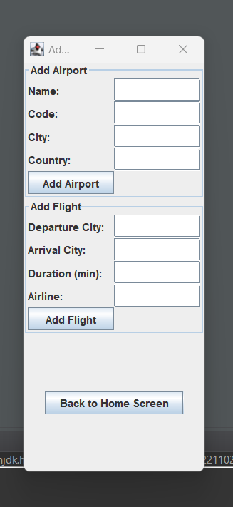

<h1>Airport-Hub-Manager</h1>

<h2>Description</h2>

The Airport Hub Manager with GUI is an interactive Java application designed to simplify the management and visualization of airports and flight schedules. This project offers a user-friendly interface that allows users to create, view, and manage a network of airports, along with the associated flights between them.

<h2>Languages and Utilities Used</h2>
<ul>
<li><b>Java</b></li>
</ul>

<h2>Environments Used </h2>
<ul>
<li><b>Eclipse</b></li>
</ul>

<h2>Program walk-through:</h2>

1) From the main menu, switch between user and admin roles, or view existing airports and flights: 

 
 
2) As a user, you can enter a starting city: 

 
 
3) Search for a destination city: 

 
 
4) View available flights, both direct and indirect: 

 
 
5) For Admin options, password:'1234': 

 
 
6) Add new airports or flights: 

 
 

